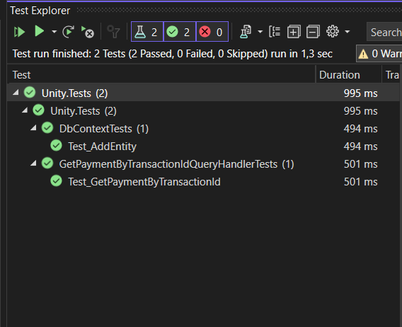

# Projeto para criação de transações simples

## Funcionalidades

- Criar transação de acordo com o valor passado
- Consultar a transação


## Tecnologias utilizadas

- .NET 6.0
- Web API
- MongoDB (API)
- RabbitMq
- Rebus orquestrador do mqqt para tratar poly,circu
- Docker

## Iniciando a aplicação

- Para iniciarmos a aplicação basta rodar o comando

``` docker-compose up ```

nele já está configurado tudo que necessitamos para a subida da api.

com isso basta acessar a aplicação pelo : <http://localhost:8081/swagger/index.html>

## Testes de unidade da aplicação

